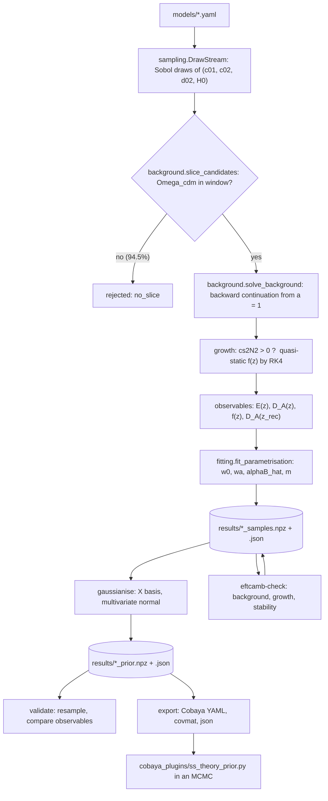

# Theoretical priors for shift-symmetric Horndeski gravity

> A Python pipeline that samples the shift-symmetric Horndeski (Kinetic Gravity Braiding) Lagrangian, solves each cosmology exactly, compresses it into the four phenomenological parameters $\{w_0,w_a,\hat\alpha_B,m\}$ used by EFTCAMB, and fits their distribution with a multivariate normal: a *theoretical prior* ready to be used in a Cobaya chain.


This repository reproduces the construction of **Traykova, Bellini, Ferreira, García-García, Noller & Zumalacárregui, *Theoretical priors in scalar-tensor cosmologies: Shift-symmetric Horndeski models*, [arXiv:2103.11195](https://arxiv.org/abs/2103.11195)**, with EFTCAMB in place of hi_class for everything that touches a Boltzmann code. Constraints on $w(a)$ and $\alpha_B(a)$ are usually obtained under broad, flat priors, but the underlying Lagrangian does not allow arbitrary combinations of them. Sampling the theory, mapping each cosmology onto the phenomenological parameters and measuring the resulting distribution gives a prior which, combined with data, can tighten the constraints by up to an order of magnitude. The output is a 4-D multivariate normal, a mean $\mu$ and a covariance $\Sigma$, together with a Cobaya likelihood that applies it.

Everything here is the $\Lambda=0$ (self-accelerating) variant of the paper: $\Omega_{\rm DE}=\Omega_\phi$ and $w=w_\phi$. See [Known limitations](#known-limitations).

## Table of Contents
- [At a glance](#at-a-glance)
- [Installation](#installation)
- [Quick start](#quick-start)
- [Repository layout](#repository-layout)
- [Pipeline architecture](#pipeline-architecture)
- [Theory](#theory)
  - [The model](#the-model)
  - [The exact background](#the-exact-background)
  - [The slice](#the-slice)
  - [Observables and growth](#observables-and-growth)
  - [The phenomenological parametrisation](#the-phenomenological-parametrisation)
  - [The fit](#the-fit)
  - [Gaussianisation](#gaussianisation)
- [The Lagrangian box](#the-lagrangian-box)
- [Configuration reference](#configuration-reference)
- [Command reference](#command-reference)
- [Output files](#output-files)
- [Where EFTCAMB is used](#where-eftcamb-is-used)
- [Using the prior in Cobaya](#using-the-prior-in-cobaya)
- [Validation and results](#validation-and-results)
- [Consistency with the paper's code](#consistency-with-the-papers-code)
- [Known limitations](#known-limitations)
- [References](#references)

---

## At a glance

The prior in `results/` comes from 30 000 accepted models (5.52% of 544 000 Sobol draws). In the basis of Eq. (23) of the paper,

```math
X_1=\hat\alpha_B,\qquad X_2=m\,\hat\alpha_B^{1/6},\qquad X_3=w_0\,m^{1/4},\qquad X_4=w_a\,m^2,
```

it reads

| | $X_1$ | $X_2$ | $X_3$ | $X_4$ |
|---|---|---|---|---|
| $\mu$ (this work) | 1.2921 | 1.6322 | −1.1763 | −0.7750 |
| $\sqrt{\Sigma_{ii}}$ (this work) | 0.462 | 0.275 | 0.040 | 0.137 |
| $\mu$ (paper, Eq. 25) | 1.5346 | 1.4461 | −1.1592 | −0.8841 |

```
Sigma = [[ 0.21376, -0.11993,  0.01522, -0.04208],
         [-0.11993,  0.07574, -0.00690,  0.02890],
         [ 0.01522, -0.00690,  0.00163, -0.00182],
         [-0.04208,  0.02890, -0.00182,  0.01884]]
```

A second prior, refitted on the 83.9% of models that EFTCAMB declares stable, is provided alongside (see [Where EFTCAMB is used](#where-eftcamb-is-used)). The differences from Eq. (25) and their origin are discussed in [Validation and results](#validation-and-results) and in [`SLICE_AND_PRIOR_BOX.md`](SLICE_AND_PRIOR_BOX.md).

---

## Installation

The pipeline itself is pure Python:

```bash
git clone <repository-url> Theoretical_prior_Shift_Symmetric
cd Theoretical_prior_Shift_Symmetric
python -m pip install -r requirements.txt
python -m pytest tests -q        # 28 tests, no Boltzmann code, a few seconds
```

| dependency | needed for |
|---|---|
| `numpy`, `scipy`, `pyyaml` | everything |
| `matplotlib` | `ssprior plot` |
| `tqdm` (optional) | progress bars |
| `cobaya` (optional) | the likelihood in `cobaya_plugins/` |
| EFTCAMB (optional) | `ssprior eftcamb-check` and the MCMC runs |

EFTCAMB is only needed for the cross-checks and for running chains. Build it separately and tell the pipeline where its Python package is, either in the model YAML or through an environment variable:

```bash
export EFTCAMB_PATH=/path/to/EFTCAMB      # the directory that contains camb/
```

`eftcamb.build_path` in [`models/shift_symmetric_lambda0.yaml`](models/shift_symmetric_lambda0.yaml) defaults to `${EFTCAMB_PATH}`; `~` and environment variables are expanded. If neither is set, every other command works and `eftcamb-check` stops with an explicit message.

---

## Quick start

`results/` already contains a complete run, so the prior can be inspected and used without recomputing anything. To reproduce it from scratch:

```bash
# 1. sample the theory and fit the parametrisation (the expensive step:
#    ~5 CPU-hours for 30 000 models, i.e. about 40 min on 8 workers)
python -m ssprior sample -c models/shift_symmetric_lambda0.yaml -n 30000 -w 8

# 2. fit the Gaussian in the basis of Eq. (23), compare with the paper
python -m ssprior gaussianise results/shift_symmetric_lambda0_samples.npz \
       --reference refs/traykova2021.json

# 3. the test that matters: does the Gaussian reproduce the observables?
python -m ssprior validate results/shift_symmetric_lambda0_samples.npz \
       -p results/shift_symmetric_lambda0_prior.npz

# 4. cross-checks against EFTCAMB (needs EFTCAMB_PATH)
python -m ssprior eftcamb-check results/shift_symmetric_lambda0_samples.npz --kind background -n 50
python -m ssprior eftcamb-check results/shift_symmetric_lambda0_samples.npz --kind growth -n 200 --calibrate
python -m ssprior eftcamb-check results/shift_symmetric_lambda0_samples.npz --kind stability -w 8

# 5. the prior restricted to EFTCAMB-stable models (always give -o, see below)
python -m ssprior gaussianise results/shift_symmetric_lambda0_samples.npz --stable-only \
       -o results/shift_symmetric_lambda0_prior_eftcamb_stable.npz

# 6. figures and export
python -m ssprior plot   results/shift_symmetric_lambda0_samples.npz -p results/shift_symmetric_lambda0_prior.npz
python -m ssprior export results/shift_symmetric_lambda0_prior.npz --format cobaya
python -m ssprior export results/shift_symmetric_lambda0_prior_eftcamb_stable.npz --format covmat \
       -o results/shift_symmetric_lambda0_prior_eftcamb_stable.covmat

# anything produced by the pipeline can be summarised with
python -m ssprior info results/shift_symmetric_lambda0_samples.npz
```

`sample` checkpoints every `run.checkpoint_every` models and can be continued with `--resume`.

---

## Repository layout

```
Theoretical_prior_Shift_Symmetric/
├── ssprior/                         the package (python -m ssprior ...)
│   ├── lagrangian.py                G2, G3, the current j, rho, p, alpha_B, alpha_K; all partials analytic
│   ├── background.py                the algebraic (psi, E) system, the slice, backward continuation
│   ├── growth.py                    quasi-static growth, cs2N2, fixed-step RK4
│   ├── observables.py               z grid, z_rec, E / D_A / f, the residuals of Eq. (21)
│   ├── parametrised.py              CPL + alpha_B = alphaB_hat (H0/H)^(4/m): EFTCAMB's designer model
│   ├── fitting.py                   the staged chi^2 minimisation
│   ├── sampling.py                  Sobol draws from the Lagrangian box
│   ├── pipeline.py                  one model end to end, and the rejection loop
│   ├── gaussianise.py               the transform of Eq. (23), the normal fit, Gaussianity diagnostics
│   ├── validate.py                  does the Gaussian reproduce the observables? (Fig. 10)
│   ├── eftcamb_check.py             background / growth / stability cross-checks against EFTCAMB
│   ├── export.py                    json / Cobaya YAML / covmat
│   ├── plotting.py                  the figures
│   ├── store.py                     .npz + JSON sidecar, written atomically
│   ├── executor.py                  process pool, plus a hang-safe pool for the Fortran code
│   ├── config.py                    the YAML schema
│   └── cli.py                       the command-line interface
├── cobaya_plugins/ss_theory_prior.py   the prior as an external Cobaya likelihood
├── models/shift_symmetric_lambda0.yaml the configuration of the run in results/
├── MCMC_inputs/Shift_Symmetric_theory_prior.yaml   a complete Cobaya input (template)
├── refs/traykova2021.json           Eqs. (25)-(26) of the paper, for comparison
├── tests/test_ssprior.py            28 tests
├── results/                         a complete 30 000-model run, with figures
├── SLICE_AND_PRIOR_BOX.md           the slice and the prior box, derived in full
├── RUFIAN_CONSISTENCY.md            comparison with the paper's own code
└── requirements.txt
```

---

## Pipeline architecture



One model goes through [`pipeline.evaluate_model`](ssprior/pipeline.py#L47) in this order: draw → slice → background → growth → observables → fit. Each rejection is recorded with its reason (`no_slice`, `bg_failed`, `ghost`, `gradient`, `growth_failed`, `fit_failed`; [`pipeline.py#L29-L36`](ssprior/pipeline.py#L29-L36)), and [`run_sampling`](ssprior/pipeline.py#L118) draws in batches, distributes the models over worker processes and checkpoints until the requested number of accepted models is reached. For the run in `results/`: 544 000 draws, 513 931 `no_slice`, 16 `bg_failed`, 21 `gradient`, 30 032 accepted (30 000 stored).

---

## Theory

### The model

Shift-symmetric Horndeski truncated at quartic order in $X$, Eq. (9) of the paper:

```math
G_2=c_{01}X+\frac{c_{02}}{\Lambda_2^4}X^2,\qquad
G_3=-\frac{1}{\Lambda_3^3}\Big(d_{01}X+\frac{d_{02}}{\Lambda_2^4}X^2\Big),\qquad
G_4=\frac{M_P^2}{2},\qquad G_5=0,\qquad X=\frac{\dot\phi^2}{2},
```

with $\Lambda_2^4=M_P^2H_{\rm fid}^2$, $\Lambda_3^3=M_PH_{\rm fid}^2$, $d_{01}=-1$ (field normalisation), and $G_4$, $G_5$ fixed by $c_{\rm GW}=1$. This is Kinetic Gravity Braiding: $\alpha_M=\alpha_T=0$, and only $\alpha_B$ and $\alpha_K$ survive.

$H_{\rm fid}$ is a **fixed fiducial**, not the sampled $H_0$ (Sec. III: *"we set this normalisation H0 to a fiducial value"*). The ratio $\tilde h=H_0/H_{\rm fid}$ therefore appears explicitly; getting this wrong rescales every Lagrangian coefficient.

Dimensionless variables and their names in the code:

| symbol | code | meaning |
|---|---|---|
| $\psi=\dot\phi/(M_PH_{\rm fid})$ | `psi` | field velocity |
| $E=H/H_{\rm fid}$ | `E` | Hubble rate |
| $\tilde h=H_0/H_{\rm fid}$ | `h_tilde` | $E$ today, exact by definition |
| $N=\ln a$ | `N` | time variable |
| $\tilde\rho,\ \tilde p$ | `rho`, `pressure` | scalar density and pressure in units of $M_P^2H_{\rm fid}^2$ |
| $\hat\alpha_B,\ m,\ u=4/m$ | `alphaB_hat`, `m`, `u` | parametrisation of $\alpha_B$ |

The equations implemented in [`lagrangian.py`](ssprior/lagrangian.py) and [`background.py`](ssprior/background.py):

| quantity | expression | in |
|---|---|---|
| current, Eq. (13) | $j=(c_{01}+c_{02}\psi^2)\psi-3(d_{01}+d_{02}\psi^2)E\psi^2$, with $j=j_ia^{-3}$ | [`Lagrangian.j`](ssprior/lagrangian.py#L71) |
| density, Eq. (11) | $\tilde\rho=\tfrac12(c_{01}+\tfrac32c_{02}\psi^2)\psi^2-3(d_{01}+d_{02}\psi^2)E\psi^3$ | [`Lagrangian.rho`](ssprior/lagrangian.py#L80) |
| pressure, Eq. (11) | $\tilde p=\tfrac12(c_{01}+\tfrac12c_{02}\psi^2)\psi^2+(d_{01}+d_{02}\psi^2)E\psi^2\psi'$ | [`Lagrangian.pressure`](ssprior/lagrangian.py#L86) |
| Friedmann, Eq. (10) | $3E^2=3\tilde h^2(\Omega_ma^{-3}+\Omega_ra^{-4})+\tilde\rho$ | [`Cosmology.rho_bg`](ssprior/background.py#L86) |
| braiding, Eq. (15) | $\alpha_B=-(d_{01}+d_{02}\psi^2)\psi^3/E$ | [`Lagrangian.alpha_B`](ssprior/lagrangian.py#L103) |
| kineticity, Eq. (15) | $\alpha_K=[\psi^2(c_{01}+3c_{02}\psi^2)-6E\psi^3(d_{01}+2d_{02}\psi^2)]/E^2$ | [`Lagrangian.alpha_K`](ssprior/lagrangian.py#L113) |

Two identities make the code both shorter and testable (both are checked in the test suite):

```math
\frac{\partial\tilde\rho}{\partial E}=\psi\,\frac{\partial j}{\partial E}=3E\alpha_B,\qquad
\tilde\rho=\psi j-\tfrac12\big(c_{01}+\tfrac12c_{02}\psi^2\big)\psi^2\quad(=\dot\phi J-G_2,\ \text{Eq. 14}).
```

On the tracker ($j=0$) the second gives $\tilde\rho=-G_2$, so a positive scalar energy density needs $c_{01}+\tfrac12c_{02}\psi_0^2<0$: a wrong-sign kinetic term in the combination that appears in $G_2$. This alone does not force $c_{01}<0$; what does is the early-time branch, discussed in [The slice](#the-slice).

### The exact background

At each scale factor the two defining equations, $j=j_ia^{-3}$ with $j_i=0$ on the tracker and the Friedmann equation, are **algebraic** in $(\psi,E)$: there is no ODE, only a root to follow. [`solve_background`](ssprior/background.py#L214) proceeds in three steps.

1. It solves the tracker cubic at $a=1$, where $E=\tilde h$ is known exactly, in closed form ([`Lagrangian.tracker_roots`](ssprior/lagrangian.py#L151)):

```math
3d_{02}E\psi^3-c_{02}\psi^2+3d_{01}E\psi-c_{01}=0 .
```

2. It continues the root **backwards** in $N$ on `background.n_grid` nodes down to `model.a_ini`, with an Euler predictor built from the analytic derivatives and a Newton corrector with the analytic $2\times2$ Jacobian. Backwards, because at $a=1$ there is an exact initial condition and forwards there is not.
3. It validates the branch against the early-time asymptote $\psi\to c_{01}/(3d_{01}E)$ ([`tracker_asymptote`](ssprior/lagrangian.py#L173)) and rejects the model if the continuation folds (the determinant of the Jacobian changes sign), if Newton fails, or if $E^2<0$. The outcome is an explicit status ([`BgStatus`](ssprior/background.py#L45)), never a bare boolean.

On the reference model of the test suite, continuity $d\tilde\rho/dN+3(\tilde\rho+\tilde p)=0$ holds to $9\times10^{-15}$, the Friedmann equation closes to $3\times10^{-14}$, and the branch lands on the asymptote to $10^{-12}$.

### The slice

The sampled $\{c_{01},c_{02},d_{02}\}$ must give $\Omega_r+\Omega_m+\Omega_{\rm DE}=1$. The paper shows (Fig. 3) that solving for one of the $c_{0i}$ by shooting biases the prior, because it introduces a non-linear correction to the measure. Instead, [`slice_candidates`](ssprior/background.py#L137-L161) reads $\Omega_\phi$ off the exact solution, lets it define $\Omega_m$, and keeps the point only if $\Omega_{\rm cdm}$ lands in its window:

```math
\Omega_\phi=\frac{\tilde\rho_0}{3\tilde h^2},\qquad
\Omega_m=1-\Omega_r-\Omega_\phi,\qquad
\Omega_{\rm cdm}=\Omega_m-\Omega_b\in[0.15,\,0.35].
```

$H_0\in[60,80]$, the $\Omega_{\rm cdm}$ window and the baryon convention ($\Omega_b=0.048275$ fixed, the CLASS 2.x default) are those of the paper's code ([`RUFIAN_CONSISTENCY.md`](RUFIAN_CONSISTENCY.md)). The test is a closed-form cubic, so the 94.5% of draws it rejects cost almost nothing.

Eliminating $c_{01}$ with the tracker cubic makes the slice explicit:

```math
c_{01}=-3\tilde h\psi_0-c_{02}\psi_0^2+3\tilde hd_{02}\psi_0^3,\qquad
3\tilde h^2\Omega_\phi=\tfrac32\tilde h\psi_0^3+\tfrac14c_{02}\psi_0^4-\tfrac32\tilde hd_{02}\psi_0^5,\qquad
\alpha_B(a{=}1)=2\Omega_\phi-\frac{c_{02}\psi_0^4}{6\tilde h^2}.
```

For each $(c_{02},d_{02},H_0)$ the window on $\Omega_{\rm cdm}$ therefore selects a thin interval of $c_{01}$: a deformed slab. Sampling $\Omega_{\rm cdm}$ as well and keeping $\sum_i\Omega_i\approx1$, as the paper does, gives the same measure, because $\sum_i\Omega_i-1$ is linear in $\Omega_{\rm cdm}$ with unit slope. The last relation is exact on the tracker (verified to $4\times10^{-14}$ on all 30 000 models) and controls how the prior depends on the Lagrangian box. Everything is derived step by step in [`SLICE_AND_PRIOR_BOX.md`](SLICE_AND_PRIOR_BOX.md).

**Why $c_{01}\le0$.** The slice alone does accept $c_{01}>0$ when $c_{02}<0$, but those models never survive the continuation. For $d_{02}\le0$ every positive tracker root must approach $\psi\approx-c_{01}/(3E)$ as $E\to\infty$, which is negative if $c_{01}>0$, and no root branch can cross $\psi=0$ because the cubic equals $c_{01}\ne0$ there.

### Observables and growth

The fit is performed on observables, not on $w(a)$ and $\alpha_B(a)$ (Sec. IV of the paper). For each model [`observables_from_background`](ssprior/observables.py#L140) computes, on 100 redshifts uniform in $\ln(1+z)$ from $z=0$ to $z=10$ plus recombination,

```math
E(z)=\frac{H(z)}{H_0},\qquad
D_A(z)=\int_0^z\frac{c\,dz'}{H(z')},\qquad
f(z)=\frac{d\ln\delta_m}{d\ln a},\qquad
D_A(z_{\rm rec}).
```

- **Grid.** The nodes are $z_k=\exp\!\big(\tfrac{k}{99}\ln11\big)-1$, $k=0,\dots,99$: the same points as the paper's code, which takes 100 rows of CLASS's background table, written at constant $d\ln a$ ([`GridSection.z_nodes`](ssprior/config.py#L171)).
- **$D_A$** follows Eq. (19) literally, i.e. it is the comoving distance. Only relative residuals enter the fit, so the factor $1+z$ cancels; `Observables.angular_diameter` converts for comparisons with CAMB.
- **$z_{\rm rec}$** is the Hu–Sugiyama fit $z_*(\omega_b,\omega_m)$ ([`z_star_hu_sugiyama`](ssprior/observables.py#L36)), identical for the exact and the parametrised model of a given sample.

The growth rate solves the quasi-static equation of Eq. (20), where a prime denotes $d/dN$:

```math
f'+f^2+\Big(2+\frac{E'}{E}\Big)f=\frac32\,\Omega_m(a)\left[1+\frac{\alpha_B^2}{2\,c_s^2N^2}\right],\qquad
c_s^2N^2=(\alpha_B-2)\Big(\frac{E'}{E}-\frac{\alpha_B}{2}\Big)+\alpha_B'-3\Omega_m(a).
```

It is integrated by a fixed-step RK4 ([`integrate_growth`](ssprior/growth.py#L63)) from $a=10^{-3}$, where $f=\Omega_m(a)^{0.55}$; the decaying mode is strongly attractive, and starting from $f=1$ instead moves the result below $z=10$ by less than $10^{-5}$. $c_s^2N^2$ ([`cs2_N2`](ssprior/growth.py#L52)) is the product $c_s^2(\alpha_K+\tfrac32\alpha_B^2)$, which is **independent of $\alpha_K$**: that is why $\alpha_K$ drops out of every observable and does not appear in the fit. A model with $c_s^2N^2\le0$ anywhere on the growth range is rejected as a gradient instability.

**Shared discretisation.** The exact and the parametrised model are evaluated on the same quadrature nodes and the same fixed-step RK4 grid, with the same initial condition. An adaptive solver would put its nodes in different places for the two models, leaving a truncation error of the same order as the $10^{-3}$ signal being fitted; with a shared scheme the leading error cancels in the residual, and the residual stays a smooth function of the parameters, which Gauss–Newton requires. Doubling the grid moves the observables by less than $10^{-6}$.

### The phenomenological parametrisation

Each exact cosmology is compressed into the four parameters of Eqs. (2) and (17), implemented in [`parametrised.py`](ssprior/parametrised.py):

```math
w(a)=w_0+w_a(1-a),\qquad
\alpha_B(a)=\hat\alpha_B\left(\frac{H_0}{H}\right)^{4/m},\qquad
\frac{\rho_{\rm DE}(a)}{\rho_{\rm DE}(1)}=a^{-3(1+w_0+w_a)}\,e^{-3w_a(1-a)} .
```

This is exactly EFTCAMB's designer shift-symmetric model (`fortran/eftcamb/07f_designer_models/007p7_ShiftSym_alphaB.f90` in the EFTCAMB source):

```fortran
RPH_PM_V = 0                                        ! alpha_M = 0
RPH_AT_V = 0                                        ! alpha_T = 0
RPH_AK_V = SS_alphaK0*a                             ! alpha_K = alpha_K0 a
RPH_AB_V = SS_alphaB0*((a*h0_Mpc)/adotoa)**(4/SS_m) ! = alphaB_hat (H0/H)^(4/m)
```

where `adotoa` is the conformal Hubble rate $aH$, so `a*h0_Mpc/adotoa` equals $H_0/H$; the expansion history comes from `EFTwDE = 2` (CPL). The parametrised model shares $\Omega_m$, $\Omega_r$ and $H_0$ with the exact one, so $E(z=0)=1$ on both sides.

### The fit

The $\chi^2$ of Eq. (21) compares the exact and the parametrised observables with relative weights:

```math
\chi^2=\sum_{O\in\{E,D_A,f\}}\ \sum_{k=1}^{100}\left(\frac{O^{\rm fit}(z_k)-O^{\rm th}(z_k)}{O^{\rm th}(z_k)\,\sigma}\right)^2
+\left(\frac{D_A^{\rm fit}(z_{\rm rec})-D_A^{\rm th}(z_{\rm rec})}{D_A^{\rm th}(z_{\rm rec})\,\sigma_{\rm rec}}\right)^2,
\qquad \sigma=10^{-3},\ \ \sigma_{\rm rec}=10^{-4}.
```

At $z=0$, where $D_A=0$ on both sides, the residual is exactly 0 ([`rel_residual`](ssprior/observables.py#L182)). The fitted parameters are allowed to differ from the best fit to the curves $w(a)$ and $\alpha_B(a)$ themselves: that is the point of fitting observables.

The parametrised expansion history depends *only* on $(w_0,w_a)$; all the information on $(\hat\alpha_B,m)$ is in $f(z)$. [`fit_parametrisation`](ssprior/fitting.py#L149) exploits this in stages:

| stage | what | cost |
|---|---|---|
| 0 | closed form ([`initial_guess`](ssprior/fitting.py#L120)): $w_0=w_\phi(1)$, $w_a=-dw_\phi/dN$, $\hat\alpha_B=\alpha_B(1)$, $u$ from a linear regression of $\ln\alpha_B$ on $\ln E$ | no evaluations |
| 1 | $(w_0,w_a)$ against $E$, $D_A$, $D_A(z_{\rm rec})$ — analytic, no ODE; exact, not just an initialisation | ~5 ms |
| 2 | $(\hat\alpha_B,u)$ against $f(z)$, with $(w_0,w_a)$ frozen | ~70 ms |
| 3 | joint refinement of all four; stages 2–3 are repeated from several starting values of $u$ (`fit.multistart_u`) and the lowest $\chi^2$ is kept | a few iterations |

**The optimiser works in $u=4/m$, not $m$.** $\alpha_B=\hat\alpha_BE^{-4/m}$ has a curvature that blows up as $m\to0$ and flattens for large $m$, whereas $\ln\alpha_B=\ln\hat\alpha_B-u\ln E$ is linear in $u$, which is what Gauss–Newton needs. The minimiser is `scipy.optimize.least_squares(method='trf')` on the residual vector rather than `minimize` on the scalar $\chi^2$: it exploits the sum-of-squares structure, handles the bounds natively, and returns the Jacobian from which $\mathrm{cond}(J^TJ)$ is stored for every model as a diagnostic of the $(\hat\alpha_B,m)$ degeneracy.

Each fit is labelled ([`FitStatus`](ssprior/fitting.py#L46)) `OK` if it meets the paper's targets — relative error below 1% on every observable at $z\le10$ and below 0.3% on $D_A(z_{\rm rec})$ — and `POOR`, `AT_BOUND` or `NOT_CONVERGED` otherwise. The labels are diagnostics: as in the paper, every fitted model enters the prior.

### Gaussianisation

The four parameters are mapped to the basis of Eq. (23) ([`to_X`](ssprior/gaussianise.py#L39)), where their distribution is close to a normal. The transform is triangular, so its inverse ([`from_X`](ssprior/gaussianise.py#L46)) is explicit, and its Jacobian is

```math
\left|\frac{\partial X}{\partial\theta}\right|=\hat\alpha_B^{1/6}\,m^{9/4},\qquad \theta=(w_0,w_a,\hat\alpha_B,m).
```

[`build_prior`](ssprior/gaussianise.py#L157) fits the sample mean and covariance and stores the Gaussianity diagnostics: Mardia's multivariate skewness and kurtosis, 1-D and Mahalanobis Kolmogorov–Smirnov statistics, and the condition number of $\Sigma$. Mardia's skewness is computed in its tensor form, $b_1=n^{-2}\sum_{abc}M_{abc}^2$ with $M_{abc}=\sum_iw_{ia}w_{ib}w_{ic}$ on the whitened sample, which costs $O(np^3)$ time and never builds an $n\times n$ matrix. `--optimise-exponents` re-derives the three exponents of Eq. (23) by minimising that skewness, as an independent check.

**The measure.** The prior is the fitted normal *in the X basis*, with a flat measure there, as in the paper. The Jacobian is what keeps that distribution unchanged when the coordinates change, so the right setting depends on the basis the chain samples:

| `basis` | `include_jacobian` | result |
|---|---|---|
| `X` | ignored | the paper's prior |
| `physical` | `true` | **the same distribution** as the `X` run, expressed in $\theta$ |
| `physical` | `false` | a *different* distribution, $N(X)/\lvert\partial X/\partial\theta\rvert$ pushed back to X |

Weighting $2\times10^6$ draws from the fitted normal by $1/\lvert\partial X/\partial\theta\rvert$ shows the size of the mistake: `basis: physical` without the Jacobian moves the mean $\hat\alpha_B$ from 1.295 to 1.515 (+17%) and $w_a$ from −0.382 to −0.539 (+41%). **If you switch to `basis: physical`, set `include_jacobian: true`.** No Jacobian is needed to read physical posteriors off an `X`-basis chain: `Shift_Symmetric_alphaB0`, `Shift_Symmetric_m`, `EFTw0` and `EFTwa` are derived columns, and transforming *samples* carries the measure automatically. The Jacobian only enters when a *density* is transformed.

---

## The Lagrangian box

The paper says only that the coefficients vary *"within a range of O(2)"* and never publishes the numbers, so the box was calibrated by measuring the slice. An edge is box-independent if the post-slice density vanishes before reaching it; if the density is still non-zero at the edge, the edge truncates the slice and becomes a parameter of the prior.

| parameter | range | status |
|---|---|---|
| $c_{01}$ | $[-60,0]$ | upper edge physical (early-time branch); lower edge contains the support ($\ge-51.7$) with margin, *for this $(c_{02},d_{02})$ box* |
| $c_{02}$ | $[-150,150]$ | not bounded by the slice; the paper's O(10²) scale |
| $d_{02}$ | $[-150,0]$ | lower edge not bounded by the slice; $d_{02}\le0$ as in Fig. 1 of the paper |
| $H_0$ | $[60,80]$ | the paper's code |

**The post-slice measure is not normalisable in $c_{02}$ and $d_{02}$.** With a uniform prior, the density of $(c_{02},d_{02},H_0)$ after the slice is the thickness $T$ of the slab along $c_{01}$, and asymptotically

```math
T\propto|d_{02}|^{2/5}\ \ (d_{02}\to-\infty),\qquad T\propto c_{02}^{1/2}\ \ (c_{02}\to+\infty)
```

(measured logarithmic slopes 0.39–0.40 and 0.50). Both integrals diverge, so there is no "box → ∞" limit: for any box the mass piles up at the outer edges. Slice-level scans with the same configuration give:

| $c_{02}$, $d_{02}$ box | minimum accepted $c_{01}$ | median $\alpha_B(a{=}1)$ |
|---|---|---|
| ±50, $[-50,0]$ | −30.9 | 1.225 ± 0.005 |
| ±150, $[-150,0]$ (this run) | −51.7 | 1.139 ± 0.003 |
| ±500, $[-500,0]$ | −88.2 | 1.032 ± 0.006 |

The median of $\alpha_B(a{=}1)$ drifts by about −0.08 per e-fold of the box scale. The mechanism is the identity $\alpha_B(a{=}1)=2\Omega_\phi-c_{02}\psi_0^4/(6\tilde h^2)$: weight at large positive $c_{02}$ drives $\alpha_B$ towards 0, weight at large negative $d_{02}$ towards $2\Omega_\phi$. There is no box-independent choice for $c_{02}$ and $d_{02}$, and this drift is **the dominant systematic** in any comparison with Eq. (25). **If you widen $c_{02}$ and $d_{02}$, widen $c_{01}$ too**: at ±500 its support reaches −88. Opening $d_{02}$ to positive values admits models with $d_{02}\psi_0^2\to1$, where $\alpha_B\to0$, the cosmology degenerates to ΛCDM and $m$ becomes unidentified; at slice level they are 6.6% of the points, with median $\alpha_B(a{=}1)=-0.57$.

The full derivation, the $c_{01}$ scans and the argument for why this systematic cannot be removed using the paper's text are in [`SLICE_AND_PRIOR_BOX.md`](SLICE_AND_PRIOR_BOX.md).

---

## Configuration reference

A run is defined by one YAML file ([`models/shift_symmetric_lambda0.yaml`](models/shift_symmetric_lambda0.yaml), parsed by [`config.py`](ssprior/config.py)). Relative paths are resolved with respect to the YAML file. Every dataset stores the configuration it was produced with, so later commands reuse it unless `-c` is given.

| section | key | value in `results/` | meaning |
|---|---|---|---|
| — | `name`, `outdir` | `shift_symmetric_lambda0`, `../results` | prefix and directory of every output |
| `model` | `d01` | −1 | field normalisation (Sec. III) |
| | `lambda_mode` | `zero` | $\Omega_{\rm DE}=\Omega_\phi$ (`free` is parsed but not supported downstream) |
| | `tracker` | `true` | $j\equiv0$; the attractor makes initial conditions irrelevant |
| | `a_ini` | $10^{-6}$ | where the backward continuation stops |
| `prior` | `c01`, `c02`, `d02`, `H0` | see [The Lagrangian box](#the-lagrangian-box) | uniform ranges |
| | `sampler`, `seed` | `sobol`, 42 | scrambled Sobol sequence (or `uniform`) |
| `cosmology` | `H_fid` | 70 | normalisation of $\Lambda_2$, $\Lambda_3$ |
| | `Omega_b` | 0.048275 | baryon fraction held fixed; remove it to hold `ombh2` fixed instead |
| | `ombh2` | 0.0224 | used only without `Omega_b` |
| | `T_cmb`, `N_eff` | 2.7255, 3.046 | radiation: photons + massless neutrinos |
| | `Omega_cdm` | $[0.15,0.35]$ | acceptance window of the slice |
| `background` | `n_grid`, `newton_tol`, `newton_max_iter` | 800, $10^{-12}$, 12 | continuation grid and corrector |
| | `reject_on_fold`, `asymptote_tol` | `true`, 0.10 | branch validation |
| `growth` | `a_start`, `f_start`, `n_steps` | $10^{-3}$, `gamma`, 400 | RK4 start, initial condition, steps |
| | `stop_on_gradient_instability` | `true` | reject if $c_s^2N^2\le0$ |
| `grid` | `n_z`, `z_min`, `z_max`, `spacing` | 100, 0, 10, `ln1pz` | observable redshifts (`log` and `linear` also available) |
| | `z_rec`, `n_quad` | `hu_sugiyama`, 2000 | recombination redshift (or `fixed:<z>`), quadrature nodes |
| `fit` | `sigma_low_z`, `sigma_rec` | $10^{-3}$, $10^{-4}$ | weights of Eq. (21) |
| | `bounds` | $w_0\in[-3,0]$, $w_a\in[-10,10]$, $\hat\alpha_B\in[10^{-6},50]$, $u\in[0.05,40]$ | box of the optimiser |
| | `multistart_u` | 0.5, 1, 2, 4, 8 | multiplicative restarts in $u$ |
| | `accept_rel_err_low_z`, `accept_rel_err_rec` | 0.01, 0.003 | the paper's accuracy targets (labels only) |
| `gaussianise` | `p2`, `p3`, `p4` | 1/6, 1/4, 2 | exponents of Eq. (23) |
| | `x_ranges` | Eqs. (27)–(28) | the MCMC box in X |
| `eftcamb` | `build_path` | `${EFTCAMB_PATH}` | EFTCAMB Python build (only for `eftcamb-check`) |
| | `alphaK0` | 10 | $\alpha_K$ today, for EFTCAMB |
| | `alphaB_convention_factor` | 1.0 | measured by `eftcamb-check --kind growth --calibrate` |
| | `timeout`, `workers`, `tau`, `As`, `ns` | 45 s, 8, 0.055, $2.1\times10^{-9}$, 0.967 | EFTCAMB cross-check settings |
| `run` | `n_models`, `workers`, `checkpoint_every` | 30000, 8, 200 | sampling run |

---

## Command reference

All commands are `python -m ssprior <command> ...`; `--help` lists every option.

| command | what it does | main options |
|---|---|---|
| `sample` | draws Lagrangians, solves, fits; writes `*_samples.npz` | `-c CONFIG`, `-n`, `-w WORKERS`, `-o`, `--resume`, `--max-trials` |
| `fit` | re-runs only the minimisation on the stored observables | `-c` (new weights or bounds), `-w`, `-o` |
| `gaussianise` | transforms to X and fits the normal; writes `*_prior.npz` | `--stable-only`, `--accurate-only`, `--trim Q`, `--optimise-exponents`, `--reference`, `-o` |
| `validate` | resamples the prior and compares observables (Fig. 10) | `-p PRIOR`, `-n`, `--seed`, `--accurate-only` |
| `eftcamb-check` | cross-checks against EFTCAMB | `--kind {background,growth,stability}`, `-n`, `-w`, `--calibrate` |
| `plot` | the figures | `-p PRIOR`, `--outdir`, `--dpi`, `--no-latex` |
| `export` | the prior as `json`, Cobaya YAML or covmat | `--format {json,cobaya,covmat}`, `-o`, `--plugin-path` |
| `info` | summarises any artefact | — |

Notes:

- `fit` cannot change the redshift grid: the observables are stored on it, and `run_refit` refuses a configuration whose grid differs from the dataset's.
- `gaussianise` without `-o` writes the default `*_prior.npz`; give `-o` for the `--stable-only` prior, or it overwrites the full one.
- `--accurate-only` restricts `gaussianise` and `validate` to the fits that meet the 1% / 0.3% targets. The paper does not do this; on this run it would move $\mu_{X_1}$ from 1.292 to 1.245 and $\Sigma_{11}$ from 0.214 to 0.153.

---

## Output files

Every artefact is an `.npz` with a JSON sidecar of the same name, both written atomically ([`store.py`](ssprior/store.py)).

| file | content |
|---|---|
| `*_samples.npz` | `theta` (30 000 × 4: $c_{01},c_{02},d_{02},H_0$), `params` (× 4: $w_0,w_a,\hat\alpha_B,m$), `derived` (× 17), `quality` (× 10), `obs` (× 301: $E$, $D_A$, $f$ on the grid and $D_A(z_{\rm rec})$), `z` |
| `*_samples.json` | column names, rejection counters, the full configuration, EFTCAMB stability flags and verdicts |
| `*_prior.npz` / `.json` | `mu`, `cov`; exponents, X ranges, number of models, Gaussianity diagnostics |
| `*_prior_eftcamb_stable.*` | the same, fitted on the EFTCAMB-stable models |
| `*_prior_cobaya.yaml` | the `params` + `likelihood` block for a Cobaya input |
| `*_prior.covmat`, `*_prior_eftcamb_stable.covmat` | $\Sigma$ in the X basis as a Cobaya proposal matrix |
| `*_prior_export.json` | the prior in plain JSON |
| `*_validation.json` | the Fig. 10 comparison and the factorisation correlations |
| `plots/*.png` | the seven figures listed below |

Columns of `derived`: `Omega_m`, `Omega_cdm`, `Omega_r`, `Omega_phi`, `psi0`, `alphaB0_exact`, `alphaK0_exact`, `w_phi0`, `z_rec`, `kinetic_D0`, `crosses_alphaB2`, `psi0_sq_over_2`, `phiddot0`, and the stage-0 guesses `guess_w0`, `guess_wa`, `guess_alphaB`, `guess_u`. Columns of `quality`: `chi2`, `err_low_z`, `err_rec`, `fit_status`, `bg_status`, `nfev`, `n_starts`, `cond_JtJ`, `n_candidates`, `elapsed`. Access them by name with `Dataset.column(name)`.

| figure | shows |
|---|---|
| `*_slice.png` | the Lagrangian coefficients after the slice (Figs. 1 and 3 of the paper) |
| `*_ansatz.png` | exact $w(a)$, $\alpha_B(a)$ against the fitted parametrisation (Fig. 4) |
| `*_histories.png` | a selection of exact and fitted histories |
| `*_fit_quality.png` | distribution of the relative errors (Fig. 7) |
| `*_corner.png`, `*_corner_X.png` | the prior in $(w_0,w_a,\hat\alpha_B,m)$ and in X (Figs. 8–9) |
| `*_alphaB2.png` | models crossing $\alpha_B=2$ (Appendix A) |

---

## Where EFTCAMB is used

### Not inside the $\chi^2$ loop

EFTCAMB's shift-symmetric module is a **designer** model: it imposes $H(a)$ from the parametrised $w_{\rm DE}$ and has no full-mapping counterpart taking $(c_{01},c_{02},d_{02})$. It cannot represent the exact Lagrangian background at all, so using it in the loop would compare the parametrised model against itself. It would also be unaffordable: `camb.get_background` takes ~0.01 s and `camb.get_results` with the matter power spectrum ~0.3 s, while the fit needs of order 150–200 evaluations per model — hundreds of core-hours for 30 000 models, against a few CPU-hours for the Python solver. This mirrors the paper's setup, where the fit is done by RUFIAN rather than inside the Boltzmann code.

### Where it is used

`python -m ssprior eftcamb-check --kind ...` ([`eftcamb_check.py`](ssprior/eftcamb_check.py)):

- **`background`** — $E(z)$, the comoving distance and $z_*$ against `hubble_parameter`, `comoving_radial_distance` and `get_derived_params()`. Both sides use the same CPL background, so any discrepancy is a mismatch in the radiation density, the neutrino treatment or the $w_{\rm DE}$ integral convention, sitting right on top of the $10^{-3}$ weighting. Requirement: $<10^{-4}$; if this fails, nothing downstream is meaningful.
- **`growth`** — quasi-static $f(z)$ against `get_fsigma8()/get_sigma8()`, and with `--calibrate` the **$\alpha_B$ convention factor**. EFTCAMB stores the braiding in its own basis and passes it to the perturbations through `EFTGamma2V`; its normalisation relative to the Bellini–Sawicki $\alpha_B$ of the paper is not documented in the source. `--calibrate` fits one scalar $s$ in $\alpha_B\to s\,\alpha_B$ over the sample and refits it on each half; the claim being tested is that $s$ is **constant**. If $s\ne1$, set `eftcamb.alphaB_convention_factor` before exporting; if it is not constant, do not export. Measured value: $s=1.0011$ with a spread of 0.01% between the two halves, so EFTCAMB's `Shift_Symmetric_alphaB0` *is* the paper's $\alpha_B$. Re-measure it if you use a different EFTCAMB build; until then the Cobaya plugin warns at load time.
- **`stability`** — EFTCAMB's ghost and gradient checks on the fitted parameters of every model, at ~20 ms each. This has no counterpart in the paper: it says what fraction of the theoretical prior the Boltzmann code that will run the MCMC actually accepts. 83.9% of the models survive (4824 of 30 000 rejected, zero timeouts), and `gaussianise --stable-only` fits the prior on them. The cut matters: it narrows $\Sigma_{11}$ from 0.214 to 0.095, a factor 2.3 in $\hat\alpha_B$, and moves $\mu$ from $(1.292,1.632,-1.176,-0.775)$ to $(1.149,1.705,-1.188,-0.757)$.

EFTCAMB runs in a hang-safe process pool ([`executor.HangSafePool`](ssprior/executor.py#L154)) with a per-model timeout, so a stuck Fortran call cannot block the run.

---

## Using the prior in Cobaya

[`cobaya_plugins/ss_theory_prior.py`](cobaya_plugins/ss_theory_prior.py) implements the prior as an external likelihood, so it multiplies the data likelihood exactly as the paper's MontePython module did. `ssprior export --format cobaya` writes a ready-to-paste block, and [`MCMC_inputs/Shift_Symmetric_theory_prior.yaml`](MCMC_inputs/Shift_Symmetric_theory_prior.yaml) is a complete input. Replace every `/path/to/...` placeholder with the locations on your machine:

```yaml
theory:
  camb:
    path: /path/to/EFTCAMB
likelihood:
  ss_theory_prior.SSTheoryPrior:
    python_path: /path/to/Theoretical_prior_Shift_Symmetric/cobaya_plugins
    prior_file: /path/to/Theoretical_prior_Shift_Symmetric/results/shift_symmetric_lambda0_prior.npz
    basis: X
```

Two bases, both correct:

- **`basis: X`** (default, and what the paper does). The chain samples $\{X_1,\dots,X_4\}$ over the ranges of Eqs. (27)–(28), and Cobaya derives EFTCAMB's parameters with `value` lambdas. The sampler moves in the basis where the distribution really is a normal, so the proposal matrix is meaningful. $X_1,\dots,X_4$ must **not** be `drop`ped: the plugin requests them.
- **`basis: physical`**. The chain samples `Shift_Symmetric_alphaB0`, `Shift_Symmetric_m`, `EFTw0`, `EFTwa` and the plugin transforms internally. Easier to add to an existing input, but the posterior is curved there, and it needs `include_jacobian: true` (see [Gaussianisation](#gaussianisation)).

As provided, the MCMC input is a **prior-only** run: the only likelihood is the theoretical prior, so the standard cosmological parameters are fixed rather than sampled (with a flat likelihood in those directions the chain would only diffuse and never reach `Rminus1_stop`). The data likelihoods and the sampled cosmological block are included, commented out, at the bottom of the file; enable them together. Use `*_prior_eftcamb_stable.covmat` as the proposal: the stability cut makes the raw $\Sigma$ about 1.5 times too wide in $X_1$, and the covmat carries the $X_1$–$X_2$ correlation ($-0.91$) that diagonal proposals cannot express.

---

## Validation and results

All numbers refer to the run in `results/`.

**Test suite** — 28 tests, no Boltzmann code:

| check | result |
|---|---|
| $\partial\tilde\rho/\partial E=\psi\,\partial j/\partial E=3E\alpha_B$, and $\tilde\rho=\psi j-G_2$ (Eq. 14) | exact to $10^{-12}$ |
| continuity $d\tilde\rho/dN+3(\tilde\rho+\tilde p)=0$ with analytic derivatives | $<10^{-12}$ |
| Friedmann equation closes on every node | $<10^{-12}$ |
| the branch lands on the early-time asymptote | rel. $10^{-6}$ |
| $w_\phi<-1$ on the tracker, rising to −1 (footnote 5) | holds |
| cubic-galileon limit: $\psi E$ constant, $\alpha_B\propto E^{-4}$, $m=1$ | $<10^{-9}$ |
| doubling the grid moves the observables | $<10^{-6}$ (vs $\sigma=10^{-3}$) |
| $c_s^2N^2=0$ in GR matter domination | exact |
| fixed-step RK4 vs `solve_ivp(rtol=1e-11)` | $<10^{-7}$ |
| growth insensitive to the initial condition | $<10^{-5}$ |
| the fit recovers synthetic parameters | rel. $2\times10^{-3}$ |
| X ↔ θ round trip; analytic vs numerical Jacobian | machine precision |
| Mardia skewness, tensor form vs the literal $n\times n$ definition | rel. $10^{-12}$ |
| the `ln1pz` grid: 100 points, $z=0\ldots10$, uniform in $\ln(1+z)$ | exact |
| residual where both sides vanish ($D_A(z=0)$) | exactly 0 |
| $\Omega_b$ fixed: $\omega_b\propto h^2$ and $\Omega_{\rm cdm}=\Omega_m-\Omega_b$ in the slice | exact |
| `fit` refuses a grid different from the stored one | raises |
| the EFTCAMB path comes from the YAML or `EFTCAMB_PATH`, never hard-coded | holds |

**Against EFTCAMB** (`eftcamb-check`, 40 and 120 models):

| quantity | median deviation | requirement |
|---|---|---|
| $E(z)$, $z<10$ | $2.4\times10^{-8}$ | $<10^{-4}$ |
| comoving distance | $6.8\times10^{-7}$ | $<10^{-4}$ |
| $z_*$ (Hu–Sugiyama vs `get_derived_params`) | $1.8\times10^{-3}$ | $<5\times10^{-3}$ |
| quasi-static $f(z)$ vs $f\sigma_8/\sigma_8$, $z=0\to3$ | 0.008% → 0.026% | consistency only |
| $\alpha_B$ convention factor $s$ | 1.0011, spread 0.01% | must be constant |

The background agreement at $10^{-8}$ is four orders of magnitude inside the $10^{-3}$ weighting of Eq. (21): the radiation density, the neutrino treatment and the $w_{\rm DE}$ integral convention all match CAMB.

**The paper's own diagnostics:**

- **Fig. 7** — 96.5% of the fits are below 1% on every observable at $z\le10$ (the paper quotes 99%) and 100% below 0.3% on $D_A(z_{\rm rec})$; the error distributions have medians at $10^{-2.9}$ and $10^{-4.1}$. Every miss has its largest error in $f$ below $z=0.1$ (1048 of 1052 exactly at $z=0$).
- **Fig. 4** — $w(z)$ runs from −1 today down to −1.2…−1.6 by $z=3$, with CPL fits that visibly do not track the curve, as the paper describes; the $\alpha_B$ fits track almost perfectly.
- **Fig. 2** — $\dot\phi_0^2/\Lambda_2^4$ has median 0.089 (paper: ~0.2), well below 1, so the truncation of Eq. (9) is self-consistent.
- **Fig. 1** — after the slice, $c_{01}$ has an interior mode near −33 (support $[-51.7,-0.1]$). $c_{02}$ is not symmetric about zero: 70.1% of the models have $c_{02}>0$ and its density rises up to the +150 edge; $d_{02}$ is broad and negative, with density rising towards −150 (median −91.7). Both shapes are the $c_{02}^{1/2}$ and $|d_{02}|^{2/5}$ growth of the slab thickness, cut off by the box.
- **Appendix A** — 8.3% of the models cross $\alpha_B=2$. They are flagged (`crosses_alphaB2`) and marked in the plots, not excluded, as in the paper.
- **Footnote 5** — $w_\phi<-1$ on the tracker, approaching −1 from below, for every model (largest $w_\phi(a{=}1)=-1.00041$).

**Fig. 10, the criterion that matters** — draw from the fitted Gaussian, map back, evaluate the parametrised model, and compare with the exact observables (30 000 exact vs 29 931 drawn):

| observable | KS | p | median exact | median drawn |
|---|---|---|---|---|
| $H(z=1)$ | 0.0096 | 0.13 | 121.51 | 121.59 |
| $D_A(z=1)$ | 0.0085 | 0.23 | 3380.7 | 3378.6 |
| $f(z=1)$ | 0.0369 | $3.9\times10^{-18}$ | 0.9161 | 0.9164 |
| $z_{\rm rec}$ | 0.0050 | 0.85 | 1089.93 | 1089.93 |
| $D_A(z_{\rm rec})$ | 0.0060 | 0.65 | 13736 | 13719 |

Every median agrees to better than 0.13% and the worst KS statistic is 0.037: **pass**, on the paper's criterion. With 30 000 models per side the KS test resolves differences far below survey precision; the small p-value for $f(z=1)$ reflects a difference in shape, with the medians 0.03% apart.

**Against Eq. (25):**

```
this work  mu = ( 1.2921,  1.6322, -1.1763, -0.7750)
paper      mu = ( 1.5346,  1.4461, -1.1592, -0.8841)
```

i.e. −16%, +13%, +1.5%, −12%. The covariance structure agrees well: the $X_1$–$X_2$ correlation is −0.94 here against −0.86 in the paper, and $\Sigma_{22}=0.0757$ against 0.0776. Exact agreement is not expected and should not be engineered: different Boltzmann code, parts of the paper's code that are not public (how $f(z)$ and $z_{\rm rec}$ are computed), and an unpublished Lagrangian box whose ±150 → ±500 widening alone moves $\alpha_B(a{=}1)$ by 9%. From the identity of [The slice](#the-slice), $\langle\alpha_B(a{=}1)\rangle=2\langle\Omega_\phi\rangle-\langle c_{02}\psi_0^4/(6\tilde h^2)\rangle=1.400-0.174=1.227$; narrowing the $c_{02}$ box removes the second term, so the mean cannot exceed about 1.40 (about 1.48 for the fitted $\hat\alpha_B$, which runs 5.4% above $\alpha_B(a{=}1)$ on average). The paper's $X_1=1.535$ is therefore out of reach of any box symmetric in $c_{02}$. That is an inference from the identity, not a measurement of the paper's setup.

**Cost.** The 30 000 accepted models took 4.9 CPU-hours of background solving and fitting (median 0.55 s per model), about 40 minutes on 8 workers; the 514 000 draws rejected by the slice cost almost nothing. `gaussianise` and `validate` take seconds; the three `eftcamb-check` commands together take a few minutes.

---

## Consistency with the paper's code

The paper's fits were made with a modified version of RUFIAN. Its public archive contains the framework (priors, redshift grid, $\chi^2$, treatment of failed and inaccurate fits) but not the shift-symmetric model. [`RUFIAN_CONSISTENCY.md`](RUFIAN_CONSISTENCY.md) compares the two line by line: the $H_0$ and $\Omega_{\rm cdm}$ priors, the baryon convention, the redshift grid, the form of the residuals and the choice of models entering the prior are the same; $f(z)$, $z_{\rm rec}$ and the optimiser differ, for reasons explained there. It also quantifies each choice: RUFIAN's grid rather than a log-spaced one moves $X_4$ by −5.7%, while the baryon convention changes which models pass the slice but not the fit of any given model.

---

## Known limitations

- **Λ = 0 only.** EFTCAMB's designer shift-symmetric model has a single dark-energy component with a CPL equation of state and cannot represent $\Omega_{\rm DE}=\Omega_\phi+\Omega_\Lambda$ with $w=w_\phi$, so Eq. (26) of the paper is not reproduced. The Python solver would need one extra term in the Friedmann equation (`model.lambda_mode: free` is already parsed); the obstacle is on the EFTCAMB side.
- **The prior depends on the Lagrangian box** through $c_{02}$ and $d_{02}$, which the slice does not bound. It is the dominant systematic with respect to the paper, and neither the paper nor the public archive of its code contains the box.
- **96.5% of the fits meet the 1% / 0.3% targets, not 99%.** Every miss has its largest error in $f$ below $z=0.1$, and 99.9% of the misses have $\hat\alpha_B>2$. The grid puts only 4 of 100 points below $z=0.1$, where $f$ departs fastest from the parametrisation; the fits are genuine minima of the $\chi^2$. The prior includes these models, as the paper's code does.
- **The X basis only partly Gaussianises the marginals, and not the 4-D joint.** 1-D skewness 1.02, −0.75, 0.88, 0.84 for $X_1$–$X_4$; Mardia's multivariate kurtosis 93.0 against 24 for a Gaussian; 3.1% of the sample beyond the $\chi^2_4$ 99.9% contour. The residual structure is the curved $\hat\alpha_B$–$m$ degeneracy, visible in the paper's own Fig. 9. It does not propagate to the observables, which is the criterion the paper uses and which passes. `gaussianise --trim 0.999` gives a robust fit; it is off by default because the paper does not use it.
- **The factorisation is an approximation.** In the sample $\Omega_m$ is derived from $(c_{01},c_{02},d_{02})$, not independent, while a chain that samples $\Omega_m$ freely treats them as independent. `ssprior validate` measures the cost: the strongest correlation is $\Omega_m$–$X_3$ at −0.53. Check it against your own run before quoting a constraint.
- **$f(z)$ is quasi-static**, as in the paper. It agrees with EFTCAMB's $f\sigma_8/\sigma_8$ to 0.03%, so it is not a limiting approximation, but the two are not the same quantity.
- **$\alpha_K$ never enters the fit**, because $c_s^2N^2$ is independent of it. The EFTCAMB runs use `Shift_Symmetric_alphaK0 = 10`.
- **The $\alpha_B$ convention factor must be re-measured for a different EFTCAMB build** (`eftcamb-check --kind growth --calibrate`).
- **No chains are run here.** The plugin and the input are provided; Sec. VI of the paper (Figs. 11–12, Table I) is left to the user.

---

## References

- D. Traykova, E. Bellini, P. G. Ferreira, C. García-García, J. Noller, M. Zumalacárregui, *Theoretical priors in scalar-tensor cosmologies: Shift-symmetric Horndeski models*, [arXiv:2103.11195](https://arxiv.org/abs/2103.11195) — the construction reproduced here; equations are cited by number throughout.
- C. García-García, E. Bellini, P. G. Ferreira, D. Traykova, M. Zumalacárregui, *Theoretical priors in scalar-tensor cosmologies: Thawing quintessence*, [arXiv:1911.02868](https://arxiv.org/abs/1911.02868) — the predecessor, and the origin of RUFIAN.
- E. Bellini, I. Sawicki, *Maximal freedom at minimum cost: linear large-scale structure in general modifications of gravity*, [arXiv:1404.3713](https://arxiv.org/abs/1404.3713) — the $\alpha_X$ basis and the quasi-static limit.
- C. Deffayet, O. Pujolas, I. Sawicki, A. Vikman, *Imperfect Dark Energy from Kinetic Gravity Braiding*, [arXiv:1008.0048](https://arxiv.org/abs/1008.0048).
- B. Hu, M. Raveri, N. Frusciante, A. Silvestri, EFTCAMB/EFTCosmoMC, [arXiv:1312.5742](https://arxiv.org/abs/1312.5742) and [arXiv:1405.3590](https://arxiv.org/abs/1405.3590); the shift-symmetric designer module is `fortran/eftcamb/07f_designer_models/007p7_ShiftSym_alphaB.f90` in the EFTCAMB source.
- W. Hu, N. Sugiyama, *Small-scale cosmological perturbations: an analytic approach*, ApJ 471, 542 (1996) — the fitting formula for $z_*$.
- J. Torrado, A. Lewis, *Cobaya: code for Bayesian analysis of hierarchical physical models*, [arXiv:2005.05290](https://arxiv.org/abs/2005.05290).
