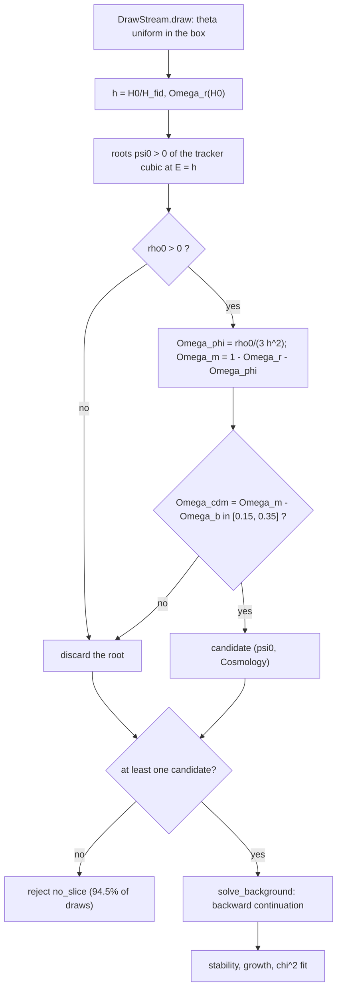

# The $\Omega$ slice and the Lagrangian prior box

> What the $\sum_i\Omega_i=1$ cut does in `ssprior`, how it fixes (and how it does **not** fix) the uniform ranges of $\{c_{01},c_{02},d_{02}\}$, and why this implies an irreducible systematic in the comparison with Traykova et al. (2021), Eq. (25).


The theoretical prior on $(w_0,w_a,\hat\alpha_B,m)$ is the push-forward of a uniform measure on a box in $(c_{01},c_{02},d_{02},H_0)$, restricted to the region where the model yields an acceptable cosmology. That region is the *slice* (or *slab*). This document derives the slice step by step from the code, shows that the measure it induces grows as $|d_{02}|^{2/5}$ and $c_{02}^{1/2}$ and is therefore not normalisable, and concludes that the prior depends on the edges of the box in $c_{02},d_{02}$, which the paper does not publish. Numbers refer to the 30 000-model run in `results/` and, where stated, to slice-level scans with the same configuration.

## Table of Contents
- [Overview](#overview)
- [Architecture](#architecture)
- [Theory](#theory)
- [Code walkthrough](#code-walkthrough)
- [How the ranges are chosen from the slice](#how-the-ranges-are-chosen-from-the-slice)
- [The systematic with respect to Traykova et al. 2021](#the-systematic-with-respect-to-traykova-et-al-2021)
- [Numerical notes and gotchas](#numerical-notes-and-gotchas)
- [Known limitations and open questions](#known-limitations-and-open-questions)
- [References](#references)

## Overview

| File | Lines | Role in the slice |
|---|---|---|
| [`models/shift_symmetric_lambda0.yaml`](models/shift_symmetric_lambda0.yaml#L42-L60) | 42–48, 56, 60 | uniform box, baryon fraction $\Omega_b$, window $\Omega_{\rm cdm}\in[0.15,0.35]$ |
| [`ssprior/sampling.py`](ssprior/sampling.py#L65-L69) | 22–69 | uniform Sobol draws of $(c_{01},c_{02},d_{02},H_0)$ |
| [`ssprior/lagrangian.py`](ssprior/lagrangian.py#L71-L99) | 71–99, 151–179 | $j$, $\tilde\rho$, $G_2$, tracker cubic, early-time asymptote |
| [`ssprior/background.py`](ssprior/background.py#L137-L161) | 137–161 | `slice_candidates`: the acceptance test |
| [`ssprior/pipeline.py`](ssprior/pipeline.py#L57-L68) | 57–68 | `no_slice` rejection, then the continuation (`bg_failed`) |
| [`ssprior/config.py`](ssprior/config.py#L116-L133) | 116–133 | $\omega_b(H_0)=\Omega_b h^2$ and $\Omega_r(H_0)$ |

## Architecture



The slice is the set of nodes from `C` to `H`: a closed-form test with no integration. In the run (`results/shift_symmetric_lambda0_samples.json`, `counters`), out of 544 000 draws 513 931 are rejected as `no_slice`, 16 as `bg_failed`, 21 as `gradient`, and 30 032 are accepted: an acceptance of $30032/544000=5.52\%$. In practice the slice is the only filter that shapes the distribution.

## Theory

### Variables

| Symbol | Code variable | Meaning |
|---|---|---|
| $\psi=\dot\phi/(M_PH_{\rm fid})$ | `psi` | dimensionless field velocity |
| $E=H/H_{\rm fid}$ | `E` | dimensionless Hubble rate |
| $\tilde h=H_0/H_{\rm fid}$ | `h_tilde` | value of $E$ today, **exact** by definition |
| $\psi_0$ | `psi0` | tracker root at $a=1$ |
| $\tilde\rho,\ \tilde G_2$ | `rho`, `g2` | density and $G_2$ in units of $M_P^2H_{\rm fid}^2$ |
| $W=[W_{\rm lo},W_{\rm hi}]$ | derived from `Omega_cdm` | allowed window for $\Omega_\phi$ |

With $d_{01}=-1$ ([`lagrangian.py:67`](ssprior/lagrangian.py#L67)):

```math
j=\psi\,(c_{01}+c_{02}\psi^2)-3E\psi^2(d_{01}+d_{02}\psi^2),\qquad
\tilde\rho=\tfrac12\psi^2\big(c_{01}+\tfrac32c_{02}\psi^2\big)-3E\psi^3(d_{01}+d_{02}\psi^2),\qquad
\tilde G_2=\tfrac12\psi^2\big(c_{01}+\tfrac12c_{02}\psi^2\big).
```

Expanding $\psi j-\tilde G_2$ term by term gives back $\tilde\rho$ (Eq. 14 of the paper; checked with SymPy):

```math
\tilde\rho=\psi j-\tilde G_2 .
```

### Step 1 — the tracker cubic today

On the tracker $j=0$. Discarding the trivial root $\psi=0$, dividing by $\psi$ and setting $E=\tilde h$:

```math
c_{01}+c_{02}\psi_0^2+3\tilde h\,\psi_0-3\tilde h\,d_{02}\psi_0^3=0. \qquad \text{(S0)}
```

The code ([`lagrangian.py:160`](ssprior/lagrangian.py#L160)) uses the coefficients $[3d_{02}E,\,-c_{02},\,3d_{01}E,\,-c_{01}]$, i.e. $-(\mathrm{S0})$ with $d_{01}=-1$: same roots.

### Step 2 — density and $\Omega_\phi$

With $j=0$, the identity above gives $\tilde\rho_0=-\tilde G_2(\psi_0)$. The Friedmann equation in tilde units at $a=1$ reads $3\tilde h^2=3\tilde h^2(\Omega_m+\Omega_r)+\tilde\rho_0$, so

```math
\Omega_{\phi}=\frac{\tilde\rho_0}{3\tilde h^2},\qquad
\Omega_m=1-\Omega_r-\Omega_\phi,\qquad
\Omega_{\rm cdm}=\Omega_m-\Omega_b .
```

Closure, $\sum_i\Omega_i=1$, holds **by construction**: $\Omega_m$ is derived, not sampled. The baryon fraction is fixed at $\Omega_b=0.048275$, the CLASS 2.x default that RUFIAN inherits ([`RUFIAN_CONSISTENCY.md`](RUFIAN_CONSISTENCY.md)).

### Step 3 — the window

$\Omega_{\rm cdm}\in[0.15,0.35]$ is equivalent to

```math
\Omega_\phi\in W=\big[\,1-\Omega_r-\Omega_b-0.35,\ \ 1-\Omega_r-\Omega_b-0.15\,\big].
```

Since $\Omega_b$ is fixed and $\Omega_r\sim10^{-4}$, the window hardly depends on $H_0$: $W=[0.6016,0.8016]$ at $H_0=60$ and $70$, and $[0.6017,0.8017]$ at $H_0=80$ (computed with `config.omega_r`).

### Step 4 — geometry: eliminating $c_{01}$

Solve (S0) for $c_{01}$:

```math
c_{01}=-3\tilde h\,\psi_0-c_{02}\psi_0^2+3\tilde h\,d_{02}\psi_0^3. \qquad \text{(S1)}
```

Substitute into $\tilde\rho_0=-\tfrac12\psi_0^2(c_{01}+\tfrac12c_{02}\psi_0^2)$. The bracket becomes $-3\tilde h\psi_0-\tfrac12c_{02}\psi_0^2+3\tilde hd_{02}\psi_0^3$, hence

```math
3\tilde h^2\,\Omega_\phi=\tfrac32\tilde h\,\psi_0^3+\tfrac14c_{02}\psi_0^4-\tfrac32\tilde h\,d_{02}\psi_0^5. \qquad \text{(S2)}
```

Geometric reading: for fixed $(c_{02},d_{02},H_0)$ and a value of $\Omega_\phi$, (S2) gives $\psi_0$ and (S1) gives a unique $c_{01}$. The slice is the region of the 4-D box between the two hypersurfaces $c_{01}=F(c_{02},\,d_{02},\,H_0,\,W_{lo})$ and $c_{01}=(F(c_{02},\,d_{02},\,H_0,\,W_{hi})$: a thin deformed slab of infinte thickness, not a lower-dimensional manifold.

Cubic-galileon limit ($c_{02}=d_{02}=0$): $\psi_0=(2\tilde h\Omega_\phi)^{1/3}$ and $c_{01}=-3\tilde h(2\tilde h\Omega_\phi)^{1/3}$; for $\tilde h=1,\ \Omega_\phi=0.7$ this gives $c_{01}=-3.36$.

### Step 5 — an exact identity for $\alpha_B$ today

With $d_{01}=-1$, $\alpha_{B,0}=(1-d_{02}\psi_0^2)\psi_0^3/\tilde h$. Dividing (S2) by $\tfrac32\tilde h$ gives $\psi_0^3-d_{02}\psi_0^5=2\tilde h\Omega_\phi-c_{02}\psi_0^4/(6\tilde h)$. Dividing by $\tilde{h}$

```math
\boxed{\ \alpha_{B,0}=2\,\Omega_\phi-\frac{c_{02}\,\psi_0^4}{6\,\tilde h^2}\ } \qquad \text{(S3)}
```

Verified symbolically and on the 30 000 stored models (maximum error $4\times10^{-14}$). Consequences: $\alpha_{B,0}\to2\Omega_\phi$ when $d_{02}$ dominates or as $c_{02}\to0$; $\alpha_{B,0}\to0$ when $c_{02}>0$ dominates (because then $c_{02}\psi_o^4\to 12\tilde{h}^2\Omega_\phi$).

### Step 6 — equivalence with the paper's construction

The paper also samples $\Omega_{\rm cdm}$ (Fig. 6) and keeps the points with $\sum_i\Omega_i=1$ (hi_class with `Omega_smg_debug`, footnote 7). With a tolerance $\epsilon$ and $\Omega_{\rm cdm}$ uniform on $R$, since $\Sigma_i\Omega_i-1=\Omega_{cdm}-\Omega_{cdm}^*(\theta) has unit in $\Omega_{cdm}$:

```math
p(\theta\mid\text{keep})\ \propto\ \int_R d\Omega_{\rm cdm}\ \mathbb 1\big[|\Omega_{\rm cdm}-\Omega^*_{\rm cdm}(\theta)|<\epsilon\big]=2\epsilon\ \mathbb 1_R\big(\Omega^*_{\rm cdm}(\theta)\big).
```

This is exactly the test in `slice_candidates`. The measure is the same as the paper's **for the same $R$ and the same box**.

### Step 7 — the induced measure and its asymptotics

With a uniform prior, the marginal density after the slice is the thickness of the slab along $c_{01}$:

```math
p(c_{02},d_{02},H_0\mid\text{slice})\ \propto\ T(c_{02},d_{02},H_0)=\int_{\rm box}dc_{01}\ \mathbb 1[\Omega_\phi\in W]\ \simeq\ \Big|\frac{\partial c_{01}}{\partial\Omega_\phi}\Big|\,\Delta W,
\qquad
\frac{\partial c_{01}}{\partial\Omega_\phi}=\frac{dc_{01}/d\psi_0}{d\Omega_\phi/d\psi_0},
```

```math
\frac{dc_{01}}{d\psi_0}=-3\tilde h-2c_{02}\psi_0+9\tilde hd_{02}\psi_0^2,\qquad
\frac{d\Omega_\phi}{d\psi_0}=\frac{\tfrac92\tilde h\psi_0^2+c_{02}\psi_0^3-\tfrac{15}2\tilde hd_{02}\psi_0^4}{3\tilde h^2}.
```

**Direction $d_{02}\to-\infty$** ($D=|d_{02}|$). In (S2) the term $\tfrac32\tilde hD\psi_0^5$ dominates, so $\psi_0\simeq(2\tilde h\Omega_\phi/D)^{1/5}$. The ratio of the leading terms is $(-9\tilde{h}D\psi_0^2)\cdot 3\tilde{h}^2/(15/2\tilde{h}D\psi_0^4)=-18/5\tilde{h}^2\psi_0^{-2}: 

```math
T\propto\psi_0^{-2}\propto D^{2/5},\qquad c_{01}\simeq-3\tilde h(2\tilde h\Omega_\phi)^{3/5}D^{2/5}.
```

**Direction $c_{02}\to+\infty$.** The term $\tfrac14c_{02}\psi_0^4$ dominates, so $\psi_0\simeq(12\tilde h^2\Omega_\phi/c_{02})^{1/4}$. The ratio is $(-2c_{02}\psi_0)\cdot3\tilde{h}^2/(c_{02}\psi^3_0)=-6\tilde{h}^2\psi_0^{-2}:

```math
T\propto c_{02}^{1/2},\qquad c_{01}\simeq-\tilde h\sqrt{12\,\Omega_\phi\,c_{02}}.
```

Logarithmic slopes of $T$ measured numerically between $10^{1.7}$ and $10^{3.7}$: 0.394, 0.399, 0.394, 0.399 for $d_{02}$ and 0.499, 0.501, 0.499, 0.499 for $c_{02}$, against 0.4 and 0.5 predicted. The marginals of $c_{02}$ and $d_{02}$ predicted from $T$, with no Monte Carlo, reproduce the histograms of the 30000-model run to within 0.003 per bin (10 bins each).

Since $\int^D x^{2/5}dx\propto D^{7/5}$ and $\int^C x^{1/2}dx\propto C^{3/2}$ diverge, **the measure of the slice is not normalisable in the $c_{02},d_{02}$ directions**. For a density $\propto x^{2/5}$ on $[0,\,D]$ the fraction of mass in the outer half is $1-2^{-7/5}=0.62$, whatever $D$.

## Code walkthrough

### `slice_candidates` — [`background.py#L137-L161`](ssprior/background.py#L137-L161)

1. `h_tilde = H0 / H_fid`, `Omega_r = omega_r(H0)` (L146–147).
2. For every real positive root of the cubic (L150; `tracker_roots`, [`lagrangian.py#L151-L171`](ssprior/lagrangian.py#L151-L171), which drops complex roots and $\psi\le10^{-12}$):
3. compute $\tilde\rho_0$ and discard the root if it is non-finite or $\le0$ (L151–153);
4. set $\Omega_\phi=\tilde\rho_0/(3\tilde h^2)$ and $\Omega_m=1-\Omega_r-\Omega_\Lambda-\Omega_\phi$ with $\Omega_\Lambda=0$ (L154–155);
5. build a `Cosmology` with $\omega_b=\Omega_bh^2$ (`ombh2_of`, L157) and keep the root only if `Omega_cdm` lies in the window (L158–159).
6. Return the list of candidates. In [`pipeline.py#L57-L68`](ssprior/pipeline.py#L57-L68) an empty list gives `no_slice`; otherwise the continuation is tried on each candidate and the first that succeeds is kept.

### The $c_{01}=0$ edge comes from the continuation, not from the slice

The slice alone accepts models with $c_{01}>0$: with $c_{01}\in[-60,60]$ they are 2.50% of the accepted points, up to $c_{01}=57.8$, all with $c_{02}\in[-150,-30]$ (for these $\tilde\rho_0=-\tilde G_2>0$ because $c_{01}+\tfrac12c_{02}\psi_0^2<0$). On 40 of them the continuation always fails (36 `NEWTON_FAIL`, 3 `ASYMPTOTE_MISMATCH`, 1 `FOLD`). The reason is analytic. For $E\to\infty$ with $d_{02}\le0$, $3E\psi(1+|d_{02}|\psi^2)\to\infty$ at any fixed $\psi$, so every positive root must tend to zero and satisfy $c_{01}+3E\psi\simeq0$, i.e. $\psi\simeq-c_{01}/(3E)$ ([`lagrangian.py#L173-L179`](ssprior/lagrangian.py#L173-L179)). If $c_{01}>0$ this root is negative; and at $\psi=0$ the left-hand side of (S0) equals $c_{01}\ne0$, so no branch of roots can cross zero. A positive root at $a=1$ therefore has no counterpart at early times.

## How the ranges are chosen from the slice

The criterion (comments in [`shift_symmetric_lambda0.yaml#L18-L41`](models/shift_symmetric_lambda0.yaml#L18-L41) and the README section *The Lagrangian box*):

1. fix a trial box and run the slice (cheap: closed form);
2. inspect the post-slice marginal of each coefficient;
3. an edge is **box-independent** if the accepted density vanishes before reaching it: widening it changes nothing;
4. if the density is still non-zero (or maximal) at the edge, the edge **truncates** the slice and its value becomes a parameter of the prior.

Outcome, per parameter:

| Parameter | Range | Origin of the edge | Status |
|---|---|---|---|
| $c_{01}$ upper | 0 | existence of the tracker branch at early times (previous section) | physical |
| $c_{01}$ lower | −60 | support down to −51.7 in the run, with $c_{02},d_{02}$ at ±150; margin | physical **only conditionally** on the $c_{02},d_{02}$ box |
| $c_{02}$ | ±150 | the paper's "O(10²)"; the slice does not fix it | truncation |
| $d_{02}$ lower | −150 | same | truncation |
| $d_{02}$ upper | 0 | choice (Fig. 1 of the paper); with $d_{02}>0$ the slice accepts 6.6% more points, with median $\alpha_{B,0}=-0.57$ | choice |
| $H_0$ | [60, 80] | RUFIAN's $h\in[0.6,0.8]$ | choice |
| $\Omega_{\rm cdm}$ | [0.15, 0.35] | RUFIAN's window; sets $W$ and hence the thickness | choice |

Box dependence. The ±150 row is the 30 000-model run; the other two are slice-level scans with the same configuration ($2^{17}$ Sobol points, $c_{01}$ box wide enough to contain the support).$\alpha_{B,0}$ is the exact value on the tracker; the errors are bootstrap errors on the median.

| $c_{02}$, $d_{02}$ box | minimum accepted $c_{01}$ | $c_{02}$ histogram (first → last of 10 bins) | $d_{02}$ histogram ($-D$ → 0) | median $\alpha_{B,0}$ |
|---|---|---|---|---|
| ±50, [−50, 0] | −30.9 | 356 → 1272 | 1120 → 428 | 1.225 ± 0.005 |
| ±150, [−150, 0] | −51.7 | 895 → 5024 | 4178 → 1667 | 1.139 ± 0.003 |
| ±500, [−500, 0] | −88.2 | 96 → 1297 | 943 → 433 | 1.032 ± 0.006 |

In every case the densities of $c_{02}$ and $d_{02}$ peak **at the edge**, as predicted by $T\propto c_{02}^{1/2},|d_{02}|^{2/5}$. The lower limit of $c_{01}$ scales with the box ($-31\to-52\to-88$), as predicted by $c_{01}\propto D^{2/5},\,C^{1/2}$: it is the image of the $(c_{02},d_{02})$ box under the map (S1)–(S2), not an independent physical bound.

The $c_{01}$ box itself, with $c_{02},d_{02}$ at ±150: $[-30,0]$ truncates (10.5% of the accepted points within 1.5 of the wall, median $\alpha_{B,0}=1.411$), while $[-60,0]$ and $[-100,0]$ give the same support ($-51.5$ and $-50.2$ with $2^{17}$ points) and the same median (1.140 and 1.145). 

## The systematic with respect to Traykova et al. 2021

1. **The prior is a functional of the box.** $p(w_0,w_a,\hat\alpha_B,m)$ is the push-forward of $\mathbb 1_{\rm box}\cdot\mathbb 1_{\rm slice}$. Because the slice measure grows without bound in $c_{02},d_{02}$ (Step 7), there is no "box → ∞" limit: for any $(C,D)$ the mass concentrates near the edges and the result depends on $(C,D)$.
2. **The physical mechanism is (S3).** The weight that grows towards $c_{02}\gg0$ drives $\alpha_{B,0}$ towards 0; the weight towards $d_{02}\ll0$ drives it towards $2\Omega_\phi$. Widening the box moves the median of $\alpha_{B,0}$ by about $(1.032-1.225)/\ln10=-0.084$ per e-fold of the box scale.
3. **The information is not in the paper.** The text only says the coefficients vary "within a range of O(2)" and that the results are then unchanged; the numerical values are not given (Fig. 3 shows axes of order 100 for $c_{02},d_{02}$, not the edges). The sampled windows of $H_0$ and $\Omega_{\rm cdm}$ are not reported in the text either; `ssprior` takes them from RUFIAN.
4. **The paper's invariance statement is not reproduced here.** Going from ±150 to ±500 changes the median of $\alpha_{B,0}$ by 9% (1.139 → 1.032), and point 1 shows that it cannot be otherwise for a fixed measure.
5. **No available lever reduces it.** Not statistics: the bootstrap error on the median of $\hat\alpha_B$ with 30 000 models is 0.0025. Not numerics: the background agrees with EFTCAMB to $2\times10^{-8}$. Not a "natural" choice: the paper itself drops the O(1) criterion because radiative corrections are $\sim10^{-40}$, so the theory provides no cutoff scale. Not calibration: tuning $(C,D)$ to reproduce the $\mu$ of Eq. (25) would make the comparison circular.
6. **What the identity implies for Eq. (25).** From (S3), $\langle\alpha_{B,0}\rangle=2\langle\Omega_\phi\rangle-\langle c_{02}\psi_0^4/(6\tilde h^2)\rangle=1.400-0.174=1.227$ in the run. For ever narrower boxes in $c_{02}$ the second term vanishes and $\langle\alpha_{B,0}\rangle\to2\langle\Omega_\phi\rangle\approx1.40$; with the mean ratio $\hat\alpha_B/\alpha_{B,0}=1.054$ measured here, that gives at most about 1.48. With the $H_0$ and $\Omega_{\rm cdm}$ windows taken from RUFIAN, the $\mu_{X_1}=1.535$ of Eq. (25) is out of reach of any box symmetric in $c_{02}$, where the second term averages to a positive value; it would need a net weight towards $c_{02}<0$, or a difference in how the fitted $\hat\alpha_B$ relates to $\alpha_{B,0}$ in their code. This is an inference from (S3), not a measurement of the paper's setup.

Conclusion: the residual 12–16% difference in $X_1$, $X_2$ and $X_4$ with respect to Eq. (25) has a floor set by the Lagrangian box, which the paper's text does not contain, and possibly by parts of the modified RUFIAN that are not public ([`RUFIAN_CONSISTENCY.md`](RUFIAN_CONSISTENCY.md)).

## Numerical notes and gotchas

> [!WARNING]
> Widening $c_{02},d_{02}$ requires widening $c_{01}$ too: at ±500 the support of $c_{01}$ reaches −88, beyond the default edge at −60. A ±150 → ±500 comparison run with $c_{01}\in[-60,0]$ mixes two truncations.

- $\alpha_B(a=1)$ from the exact solution and the fitted $\hat\alpha_B$ are different quantities: their medians in the run are 1.139 and 1.222. Box-scan numbers quoted at slice level refer to the former.
- `slice_candidates` accepts **any** positive root with $\Omega_{\rm cdm}$ in the window; the pipeline keeps the first one that survives the continuation (roots ordered by increasing $|\psi_0|$).
- 70.1% of the models have $c_{02}>0$ and the density of $c_{02}$ rises monotonically up to +150: the post-slice $c_{02}$ distribution is not symmetric about zero, because of the $c_{02}^{1/2}$ growth of $T$ and the sign asymmetry of the $c_{02}\psi_0^4$ term in (S2).
- Changing the baryon convention changes *which* models pass the slice, not the fit of any given model: for fixed $(c_{01},c_{02},d_{02},H_0)$, $\Omega_m$ is fixed by closure and only its split into $\Omega_b+\Omega_{\rm cdm}$ moves.

## Known limitations and open questions

- The actual edges of the paper's box remain unknown.
- The box dependence was measured on the slice (exact $\alpha_{B,0}$), not by re-running the full pipeline for each box. The other filters remove about 0.1% of the models that pass the slice (37 of 30 069), so the approximation is small, but the fitted $\hat\alpha_B$ values were not recomputed for each box.
- It has not been checked whether the paper's sentence "the final results are unchanged" refers to the theoretical prior or to the constraints combined with data.

## References

- D. Traykova, E. Bellini, P. G. Ferreira, C. García-García, J. Noller, M. Zumalacárregui, *Theoretical priors in scalar-tensor cosmologies: Shift-symmetric Horndeski models*, arXiv:2103.11195v3, Sec. III (slice, Fig. 3, footnote 7), Sec. IV–V (Eqs. 21, 23, 25).
- C. Deffayet, O. Pujolas, I. Sawicki, A. Vikman, *Imperfect Dark Energy from Kinetic Gravity Braiding*, JCAP 2010, 026.
- [`README.md`](README.md), sections *The slice* and *The Lagrangian box*.
- [`RUFIAN_CONSISTENCY.md`](RUFIAN_CONSISTENCY.md), for the $H_0$, $\Omega_{\rm cdm}$ and $\Omega_b$ conventions.
